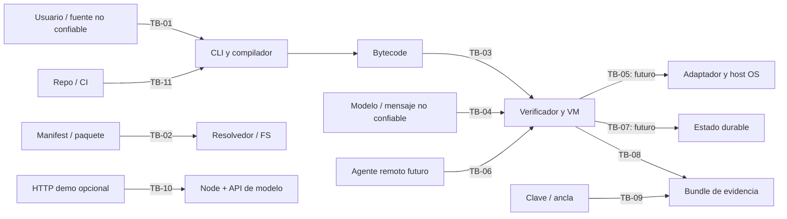

# ArgorixLang threat model — MAT-002

## Executive summary

El objetivo primario confirmado es CLI y runtime local en los dos perfiles del [contrato](spec/product-contract.md). Este documento modela el código observado en `5d73d663bf5b85fd71bdd0cbc1ac1636959d7e64` y el producto R1–R3 por separado. La VM actual valida y planifica: la ejecución externa real está deshabilitada en `crates/argorix_vm/src/vm.rs`. Por tanto, no se afirma que el núcleo ya contenga acciones de proveedores reales, agentes remotos ni efectos del host. Los riesgos principales al madurar el producto son hacer pasar datos por autoridad, fiarse de bundles sin ancla/sensor, atravesar raíces de archivos y activar adaptadores antes de tener aislamiento efectivo. El demo HTTP tiene un flujo externo propio y debe evaluarse sólo si se despliega.

## Scope and assumptions

- Incluido: `crates/argorixc`, `argorix_bytecode`, `argorix_module`, `argorix_vm`, `argorix_provider`, `argorix-sign`, flujos de evidencia y el demo opcional; CI/release como origen de binarios. La matriz detallada está en [spec/trust-boundaries.md](spec/trust-boundaries.md) y [spec/claims.json](spec/claims.json).
- Primera implantación: CLI/runtime local. Ubuntu 24.04 x86-64 y Windows 11 x86-64 son perfiles objetivo **no validados como release**. El demo web no es el despliegue primario. Agentes remotos y ejecución real son requisitos R2 futuros.
- La pregunta de si se permitirán datos sensibles y credenciales reales desde la primera release aún requiere decisión del usuario. Hasta fijarla, este modelo adopta la postura conservadora de tratarlos como activos potenciales, pero no declara admitido su uso. MAT-007/012 deben concretar la política antes de habilitarlos.
- Un atacante puede aportar programas/paquetes/bytecode/mensajes/bundles o comprometer una dependencia. No se supone kernel, cuenta local de operador ni ancla raíz ya comprometidos; de ocurrir, la confianza local y las conclusiones se invalidan.
- Las rutas y símbolos citados son evidencia de diseño/código actual, no pruebas de seguridad empírica. Cada test T-01–T-11 de MAT-002 está planificado, no ejecutado contra un candidato R1–R3.

## System model

### Primary components

| Componente | Función y nivel de confianza observado |
| --- | --- |
| CLI/compilador y resolvedor | Aceptan fuente/manifest/paquetes del filesystem local. `crates/argorix_module/src/resolver.rs` hace normalización léxica de paths. |
| Bytecode/VM | `verify_bytecode` en `crates/argorix_bytecode/src/bytecode.rs`; `Vm::run_runtime_profile` en `crates/argorix_vm/src/vm.rs` bloquea o planifica efectos externos sin ejecutarlos. |
| Registro de providers | `crates/argorix_provider/src/registry.rs` permite sólo provider ejecutable simulado en el producto actual; `eval-tripwire` es experimento delimitado. |
| Evidencia, firma y verificador | `crates/argorix_vm/src/evidence.rs`, `signature.rs` y `crates/argorix-sign/src/main.rs`; digests más firma opcional con ancla. |
| Host local | Filesystem, procesos, red, memoria y permisos OS, fuera del lenguaje. Aislamiento final pendiente MAT-011. |
| Demo Node | `demo/argorix-chatbot-runtime/app/api/chat/route.ts` recibe HTTP y puede llamar modelo externo desde `lib/openai/callOpenAI.ts`; no es el adaptador de producción del núcleo. |
| Build/release | `.github/workflows/ci.yml` y `security.yml` ejecutan pruebas/auditoría Rust; reproducibilidad y procedencia R1 pendientes. |

### Data flows and trust boundaries

TB-01/02 cruzan archivos del desarrollador y filesystem hacia compiler/resolver. TB-03/04 cruzan bytecode y propuestas hacia VM/política. TB-05 cruza del runtime a sinks del host; actualmente la VM no ejecuta externos. TB-06/07 son límites futuros entre agentes y estado durable. TB-08/09 unen evidencias y claves a un verificador. TB-10 es el demo HTTP opcional. TB-11 une repositorio/CI con ejecutables distribuidos. [Cada frontera](spec/trust-boundaries.md) tiene activo, amenaza, control observado, prueba y riesgo residual.

#### Diagram

## Assets and security objectives

| Activo | Objetivo |
| --- | --- |
| Código, manifests, paquetes y bytecode | Interpretación reproducible; ningún archivo ajeno leído por import no autorizado. |
| Política, identidad, capacidades y presupuesto | Nada declarativo concede autoridad; fallo/ausencia/revocación deniega efectos. |
| Secretos y claves | No se filtran a fuente, trazas, respuestas o paquetes; anclas y rotación explícitas. |
| Estado y efectos | Efecto permitido una vez; efecto incierto se reconcilia, no se reintenta ciegamente. |
| Evidencias | Integridad, procedencia y vínculo a fuente/efecto verificables fuera de la VM. |
| Binarios de release | Procedencia y reproducibilidad sin Rust para la entrega independiente. |

## Attacker model

**Capabilities.** Proveer archivos/bytecode/paquetes y datos de modelo; manipular bundle no anclado; ser emisor remoto extranjero cuando exista canal; enviar HTTP al demo si se publica; publicar dependencia hostil o introducir configuración errónea. Un atacante local con lectura de claves o control de la cuenta equivale a una clase distinta y más potente.

**Non-capabilities.** No se atribuye por defecto control de kernel, OS, cuenta de operador, clave de firma válida o pipeline completo. No se presupone que los metadatos DID/VC sean verificaciones ni que el demo sea público. Las conclusiones de ausencia de efectos requieren sensor externo positivo.

## Entry points and attack surfaces

| Superficie | Entrada / evidencia | Estado |
| --- | --- | --- |
| CLI y paquetes | Fuente, manifest, imports: `crates/argorixc/src/main.rs`, `crates/argorix_module/src/resolver.rs` | Actual |
| VM | Bytecode, perfil y propuestas: `crates/argorix_bytecode/src/bytecode.rs`, `crates/argorix_vm/src/vm.rs` | Actual, sin externo real |
| Artefactos/keys | Bundles, rutas, firma, ancla: `crates/argorix_vm/src/evidence.rs`, `signature.rs` | Actual, alcance parcial |
| HTTP demo | `/api/chat`, Node, archivos generados y API modelo: `demo/argorix-chatbot-runtime/app/api/chat/route.ts` | Opcional/condicional |
| Agentes y tools externos | MCP/A2A, adaptadores reales y estado durable | Objetivo R2, no validado hoy |
| Supply chain | Dependencias y workflows: `.github/workflows/ci.yml`, `security.yml` | Actual CI Rust, release R1 futura |

## Top abuse paths

1. **Paquete local hostil:** import usa nombre léxicamente válido pero symlink/junction apunta fuera de la raíz; el resolvedor lee un archivo ajeno. No se afirma explotación verificada: falta T-02 para comprobar el manejo real del FS.
2. **Bytecode no confiable:** un programa manipulado intenta eludir verificaciones o consumir recursos; `verify_bytecode` filtra estructura, pero T-03 debe medir límites de tiempo/memoria y semántica con mutaciones.
3. **Propuesta como permiso:** un modelo o mensaje incluye texto de política, DID o jurisdicción y pide herramienta. La VM actual planifica/no ejecuta; el futuro adaptador debe exigir autoridad autenticada al despacho, no inferirla del texto.
4. **Bundle autoconsistente:** atacante cambia traza/reporte/digests juntos. Un hash verifica consistencia, no origen; sólo firma contra ancla y sensor externo soportan afirmaciones más fuertes.
5. **Claves incorrectas/robadas:** operador usa ancla equivocada o archivo de clave se copia; la verificación criptográfica no aporta revocación ni protege archivo local.
6. **Replay remoto futuro:** emisor con mensaje duplicado/revocado busca doble efecto. Sin identidad/correlación/estado durable implementados, no habilitarlo como capacidad segura.
7. **Demo publicado:** cliente sin cuota/auth visible manda peticiones repetidas o contenido que sortea regex; el flujo Node puede consumir API externa. La exposición e impacto dependen del despliegue real.
8. **Release sustituto:** CI verde para fuentes Rust se extrapola a binario distribuido sin reproducibilidad/firma; tercero instala un ejecutable distinto.

## Threat model table

| Threat ID | Threat source | Prerequisites | Threat action | Impact | Impacted assets | Existing controls (evidence) | Gaps | Recommended mitigations | Detection ideas | Likelihood | Impact severity | Priority |
| --- | --- | --- | --- | --- | --- | --- | --- | --- | --- | --- | --- | --- |
| TM-01 | Paquete hostil | Operador compila paquete no confiable | Symlink/junction escapa raíz | Lectura local indebida | FS/secretos | Normalización léxica, `resolver.rs` | Falta contención de destino real probada | Canonicalizar con política de symlink o abrir relativo a dir handle; T-02 | Centinela fuera de raíz y audit FS | Media condicional | Alta si hay secretos legibles | P1 |
| TM-02 | Bytecode hostil | CLI/VM acepta artefacto externo | Malformar instrucción o agotar recurso | Caída/DoS; bypass futuro | Runtime/política | `verify_bytecode`, `bytecode.rs` | No equivale a cuota host ni prueba completa | Fuzz, límites OS, validación semántica; T-03 | Crash, timeout, memoria | Media | Media | P1 |
| TM-03 | Modelo/proveedor | Adaptador externo futuro | Hacer pasar contenido por autoridad | Efecto no autorizado | Capacidades/host | `vm.rs` actualmente bloquea o planifica | No hay mediación de sink real | Capacidad por operación y check at dispatch; T-04/05 | Sensor externo con positivo | Alta si se habilita sin gate | Crítica | P0 para R2 |
| TM-04 | Manipulador de bundle | Consumidor acepta paquete no anclado | Reescribir traza/digests | Evidencia engañosa | Auditoría | `evidence.rs` digests y firma opcional | Sin ancla no autenticidad; sensor externo ausente | Exigir ancla y ligar fuentes/efecto; T-08 | Comparación fuente/sensor | Alta en ese supuesto | Alta | P1 |
| TM-05 | Atacante local / error operador | Acceso a key o ancla equivocada | Firmar falso o aceptar firmante no deseado | Suplantación/evidencia falsa | Claves/identidad | `signature.rs`, `argorix-sign` | Ciclo/almacenamiento/revocación | Política de claves, permisos, rotación; T-09 | Inventario de anclas y eventos | Media condicional | Alta | P1 |
| TM-06 | Emisor remoto futuro | Canal remoto habilitado | Replay o usar concesión revocada | Doble efecto/acceso | Estado/autoridad | Metadatos declarativos, `README.md` | Sin canal autenticado/revocación | MAT-012/015/017; T-06/07 | Nonce/correlación y sensor | Alta si se habilita antes | Crítica | P0 para R2 |
| TM-07 | Cliente HTTP hostil | Demo expuesto a terceros | Saturar endpoint/saltar regex | Costo, disponibilidad, posible exposición de datos | Clave/API/demo | Handler y timeout, `route.ts`, `runArgorix.ts` | Auth/límites no visibles; regex no es frontera | Borde auth, body/rate/budget, no publicar sin T-10 | Cuota, logs sin secretos | Media condicional | Alta | P1 si público |
| TM-08 | Dependencia/build hostil | Publicación sin procedencia completa | Sustituir binario/release | Código arbitrario local | Instalación/keys | CI y security workflows | Falta R1 reproducible/firma | Builds limpios y firma/verificación; T-11 | Hash diff y attestations | Media condicional | Crítica | P0 para release |
| TM-09 | Estado manipulado/fallo | Persistencia futura | Corromper backup o repetir efecto incierto | Pérdida/doble efecto | Estado/efectos | Bundle/trace no transaccional | No WAL/reconciliación | MAT-010/017; T-07 | Sensor externo y journal | Alta si se habilita sin diseño | Alta | P0 para R2 |

## Criticality calibration

- **P0 para R2/release** significa gate de activación, no vulnerabilidad explotable hoy: sin adaptador remoto/externo productivo en el núcleo, TM-03/TM-06/TM-09 son riesgos de diseño futuro; TM-08 aplica al distribuir binarios.
- **P1 condicional** exige contexto: TM-07 sólo al publicar demo; TM-01 sólo si el resolvedor sigue un enlace a un archivo accesible; TM-04 sólo si un consumidor confunde autoconsistencia con autenticidad.
- **Impacto crítico** se reserva para efectos reales no autorizados o binario malicioso instalado. Un fallo controlado de parser en CLI local suele ser disponibilidad media; no se equipara a compromiso remoto.
- La clasificación es hipótesis para priorización. T-01–T-11 y la campaña independiente deben confirmar/rebajarla según evidencia y perfil de release.

## Focus paths for security review

| Ruta | Pregunta concreta | Tarea/prueba |
| --- | --- | --- |
| `crates/argorix_module/src/resolver.rs` | ¿Puede un symlink/junction salir de raíz pese a `normalize_relative`? | MAT-016 / T-02 |
| `crates/argorix_vm/src/evidence.rs` | ¿Puede un artefacto enlazado o bundle sin ancla producir veredicto exagerado? | MAT-018 / T-08 |
| `crates/argorix_vm/src/vm.rs` y `crates/argorix_provider/src/registry.rs` | ¿Todo sink real tendrá autorización final y sensor positivo? | MAT-006/011/013 / T-04/05 |
| `crates/argorix-sign/src/main.rs` | ¿Qué política protege, rota y revoca claves y anclas? | MAT-007/012 / T-09 |
| `demo/argorix-chatbot-runtime/app/api/chat/route.ts` | ¿El despliegue, si es público, autentica y limita gasto/cuerpo/tasa? | MAT-024 / T-10 |
| `.github/workflows/ci.yml` y `security.yml` | ¿El binario distribuido corresponde al código revisado y compila sin Rust? | ESP-023/MAT-023 / T-11 |

## Notes on use

Este informe es un mapa para falsar garantías, no una certificación. Los controles actuales y los faltantes no deben mezclarse en mensajes de release. La decisión pendiente sobre datos sensibles/credenciales puede elevar criticidad, restricciones y controles requeridos; no reduce las obligaciones `SEC-005` ya fijadas en MAT-001.
