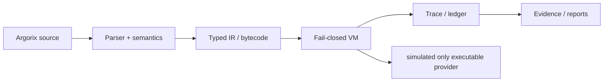
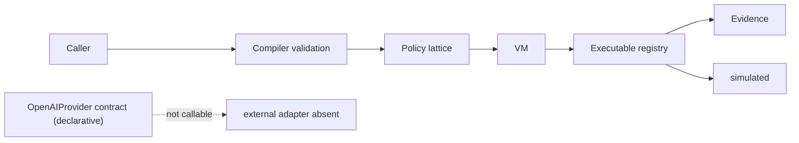
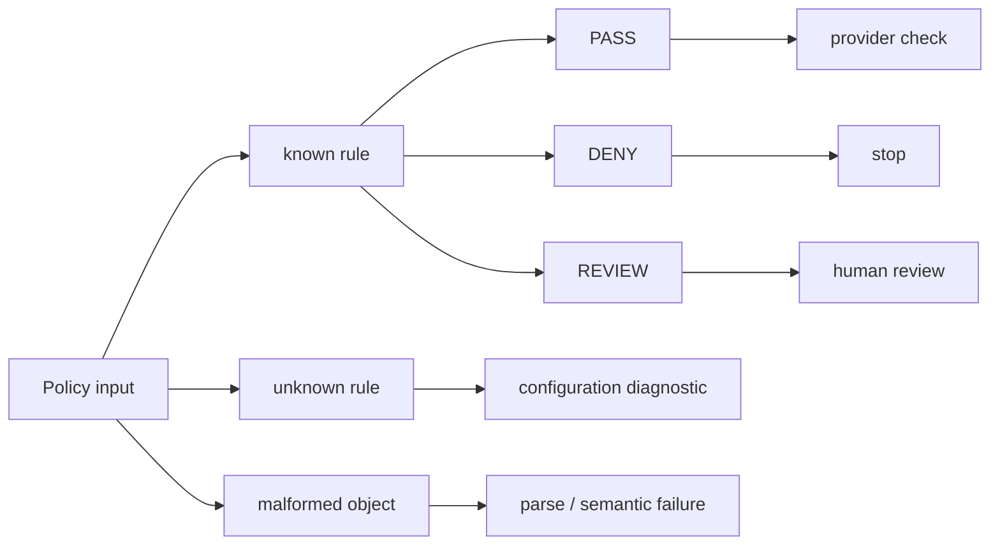
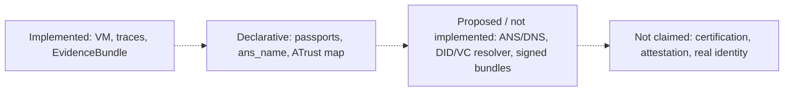
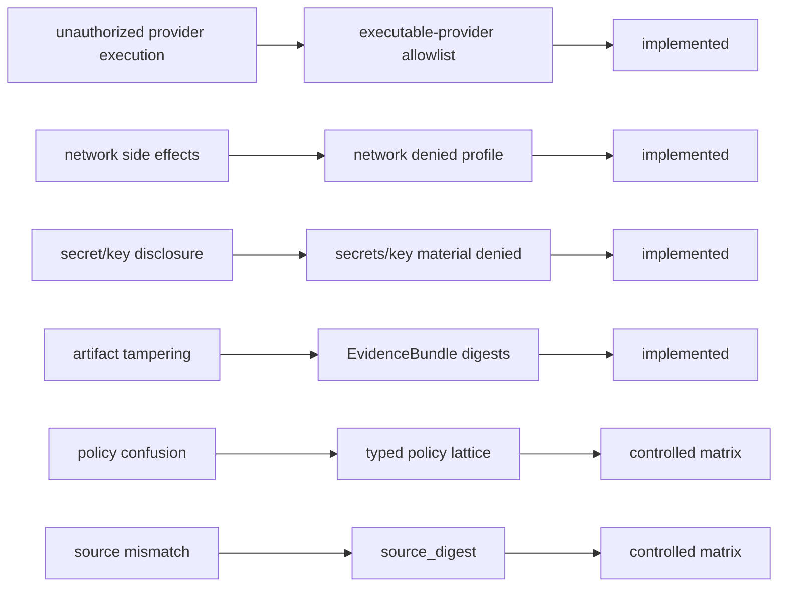

# Figure redesign plan

This audit treats figures as evidential devices, not decoration. The main paper
is reduced to seven figures. Captions are claim-bounded: each states what the
figure shows and what must not be inferred.

## A. Current figure diagnosis

| Old figure source | Action | Current function | Problem / overclaim risk | Recommended caption direction |
|---|---:|---|---|---|
| `architecture.pdf` | REVISE | System stack overview. | Too broad as a trust-stack picture; could imply external verification. | Show implemented compilation/runtime/evidence path; state metadata is not external verification. |
| `request-sequence.pdf` | MERGE | Request lifecycle. | Duplicates runtime flow and provider boundary. | Merge with provider boundary; distinguish contract from executable adapter. |
| `decision-state-machine.pdf` | MERGE | Fail-closed state machine. | Repeats provider lifecycle; older binary framing is too narrow for v0.2 lattice. | Fold fail-closed VM into provider-boundary figure. |
| `policy-heatmap.pdf` | DELETE | Bubble/event volume chart. | Visually inflates 7,155 events and 1,188 findings from repeated snapshots. | Replace with sober empirical table already in the manuscript. |
| `session-outcomes.pdf` | DELETE | Completeness bar chart. | Useful but not central enough for seven-figure limit. | Keep completeness in the empirical table. |
| `evidence-chain.pdf` | REVISE | Evidence verification scope. | Needs explicit v0.1 vs v0.2 source-digest split. | Show v0.1 bundle internals and v0.2 source_digest extension separately. |
| `artifact-schema.pdf` | MERGE | Artifact relationship schema. | Duplicates evidence-chain scope. | Merge into revised evidence-scope figure. |
| `claim-boundaries.pdf` | REVISE | Claim-boundary taxonomy. | Correct concept, but should be simpler and example-driven. | Four claim classes with small examples and no assurance upgrade. |
| `threat-mitigation.pdf` | REVISE | Threat/control overview. | Needs explicit claim-status column and controlled-matrix distinction. | Threat -> control -> claim status; no adversarial success-rate claim. |
| `trust-relationships.pdf` | MOVE TO APPENDIX | Local identity/trust relationship map. | Can suggest authenticated identity or live trust. | If restored, caption must say local metadata only. |
| `sovereign-discovery.pdf` | MOVE TO APPENDIX | Local vs proposed discovery. | Main-paper duplicate of claim-boundary taxonomy; live ANS/DNS risk. | Optional appendix figure: local ans_name is not operational DNS/ANS. |
| `evolution-timeline.pdf` | MOVE TO APPENDIX | Roadmap/history. | Does not directly support central evidence claims. | Keep as prose or appendix roadmap only. |

## B. Final main-paper figure list

| Figure | Old figure source | Action | New title | Placement | Required file name | Caption |
|---:|---|---|---|---|---|---|
| 1 | `architecture.pdf` | revise | System pipeline and evidence boundary | after Introduction | `system-pipeline.pdf` | ArgorixLang compilation and evidence pipeline. Solid paths denote implemented compilation and runtime behavior. Metadata layers do not imply external verification, live federation, legal compliance, or real-world identity proof. |
| 2 | `request-sequence.pdf` + `decision-state-machine.pdf` | merge | Provider boundary and request lifecycle | Language and Compiler Architecture | `provider-boundary.pdf` | Provider contracts are declarations; only registered executable adapters may be called. In the evaluated path, `simulated` is the only executable provider. The diagram does not imply live external-provider execution or production sandboxing. |
| 3 | new | create | Typed policy lattice v0.2 | Methodology | `policy-lattice-flow.pdf` | The v0.2 lattice separates policy approval, denial, review, configuration errors, and malformed policies. `UNKNOWN_RULE` is not treated as an ordinary violation, and the figure does not imply legal or operational approval outside the local controlled matrix. |
| 4 | `evidence-chain.pdf` + `artifact-schema.pdf` | merge/revise | EvidenceBundle verification scope with source_digest | Evidence | `evidence-scope.pdf` | Offline evidence scope for historical v0.1 bundles and source-digest extension in the controlled v0.2 matrix. v0.1 verifies internal consistency among bytecode, trace, report, and ledger digest; v0.2 controlled fixtures additionally test source-digest matching and source-mismatch detection. The figure does not establish authorship, trusted time, external attestation, or absence of side effects. |
| 5 | `claim-boundaries.pdf` | revise | Claim boundary taxonomy | Evidence | `claim-boundaries.pdf` | Claim-boundary taxonomy for interpreting every result. It separates implemented mechanisms, declarative metadata, proposed/not implemented architecture, and properties not claimed; digest success is not upgraded into approval, attestation, certification, or real-world identity. |
| 6 | new | create | Controlled matrix outcome distribution | Results | `controlled-matrix-outcomes.pdf` | Controlled v0.2 matrix outcome distribution across 57 deterministic cases. The matrix exercises local metadata validation, policy typing, provider denial, source-digest checks, and tamper detection; it does not evaluate legal compliance, physical residency, or broad workload prevalence. |
| 7 | `threat-mitigation.pdf` | revise | Threat-to-control mapping | Security Analysis | `threat-control-mapping.pdf` | Threat-to-control mapping for the evaluated architecture and controlled matrix. Mapping means a control is present or exercised in the controlled matrix; it is not an adversarial success-rate measurement, security certification, or proof of production isolation. |

## C. Appendix candidates

- `trust-relationships.pdf`: optional appendix as “Local identity metadata vs trust declarations.”
- `sovereign-discovery.pdf`: optional appendix as “Local ans_name vs proposed sovereign discovery.”
- `evolution-timeline.pdf`: optional appendix roadmap only.

## D. Deleted from main paper

- `policy-heatmap.pdf`: removed because bubble scaling can overstate repeated snapshot counts.
- `session-outcomes.pdf`: removed from main figure set; empirical totals remain in `tab:empirical`.
- `artifact-schema.pdf`, `request-sequence.pdf`, `decision-state-machine.pdf`, and `evidence-chain.pdf` are replaced by merged scope figures.

## E. Mermaid/TikZ/SVG prompts

### Figure 1: `system-pipeline.pdf`

Description: left-to-right pipeline with three boundaries: implemented
compilation flow, fail-closed runtime boundary, offline evidence boundary.
Solid arrows only for implemented flow. Add a lower box for simulated-only
provider.



Suggested colors: blue for compilation, red for runtime boundary, green for
evidence.

### Figure 2: `provider-boundary.pdf`

Description: top row request lifecycle; bottom row separates declarative
provider contract from executable adapter. External contract is dashed and not
callable; simulated is solid.



### Figure 3: `policy-lattice-flow.pdf`

Description: policy input branches into known rule, unknown rule, malformed
object. Known rules branch to PASS, DENY, REVIEW. Unknown rule becomes
UNKNOWN_RULE diagnostic; malformed object becomes ERROR.



### Figure 4: `evidence-scope.pdf`

Description: two horizontal bands. v0.1 band places source outside bundle
verification and bytecode/trace/report/ledger/EvidenceBundle inside. v0.2 band
adds source_digest binding and source mismatch to VERIFIER_FAIL.

```mermaid
flowchart LR
  Source["session.argx source"] -. outside v0.1 verification .-> Bytecode
  Bytecode --> Trace --> Report --> Ledger["ledger digest"] --> Bundle["EvidenceBundle"]
  Source2["session.argx source"] --> Digest["source_digest"] --> Artifacts["generated artifact set"] --> Fail["mismatch -> VERIFIER_FAIL"]
```

### Figure 5: `claim-boundaries.pdf`

Description: four columns with examples. Proposed/not implemented and not
claimed use dashed boxes.



### Figure 6: `controlled-matrix-outcomes.pdf`

Description: sober bar chart with outcome counts PASS=34, DENY=5, REVIEW=6,
UNKNOWN_RULE=1, ERROR=6, VERIFIER_FAIL=5. No bubbles.

TikZ pseudocode:

```tex
\begin{tikzpicture}
  \begin{axis}[ybar, symbolic x coords={PASS,DENY,REVIEW,UNKNOWN_RULE,ERROR,VERIFIER_FAIL}]
    \addplot coordinates {(PASS,34) (DENY,5) (REVIEW,6) (UNKNOWN_RULE,1) (ERROR,6) (VERIFIER_FAIL,5)};
  \end{axis}
\end{tikzpicture}
```

### Figure 7: `threat-control-mapping.pdf`

Description: three-column mapping Threat -> Control -> Claim status. Use
implemented vs controlled-matrix status, with a dashed future-assurance box for
signed bundles.



## F. No-overclaim checklist

- No figure claims security certification.
- No figure claims legal compliance or physical residency.
- No figure claims real identity verification.
- No figure claims live ANS/DNS resolution.
- No figure claims cryptographic attestation or trusted time.
- No figure claims production sandboxing.
- No bubble chart remains for 7,155 events or 1,188 findings.
- Controlled matrix counts are labeled deterministic cases, not prevalence.
- Dashed/dotted styling marks proposed, absent, or outside-claim elements.
